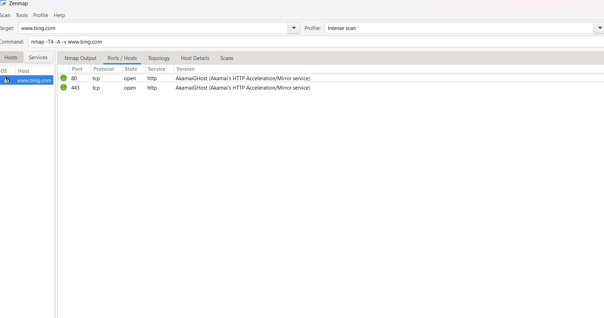
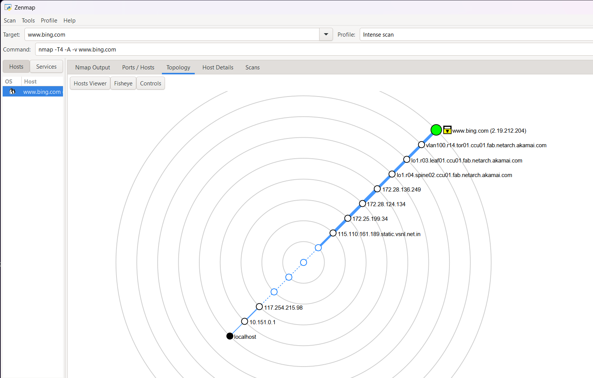

# Nmap Port Scanner Analysis

A cybersecurity project demonstrating network reconnaissance and port scanning using Nmap to identify open ports, running services, and basic security insights.

## Objective
The objective of this project is to perform network reconnaissance using Nmap and identify open ports and running services on a target system. The project also demonstrates basic security assessment techniques.

## Tools Used
- Nmap
- Kali Linux / Windows
- Command Prompt / Terminal

## Features
- Host discovery
- Port scanning
- Service version detection
- Basic network reconnaissance
- Security observations

## Commands Used
```bash
nmap -sV <target-ip>
nmap -A <target-ip>
nmap -Pn <target-ip>
nmap -p- <target-ip>
```

## Screenshots
Screenshots of the scanning process are available in the **screenshots** folder.

## Project Outcome
- Identified open ports
- Detected running services
- Performed basic network reconnaissance
- Gained hands-on experience with Nmap

## Disclaimer
This project was performed only in a controlled environment for educational and ethical learning purposes.

## Project Screenshots

### Nmap Output


### Ports


### Network Topology

